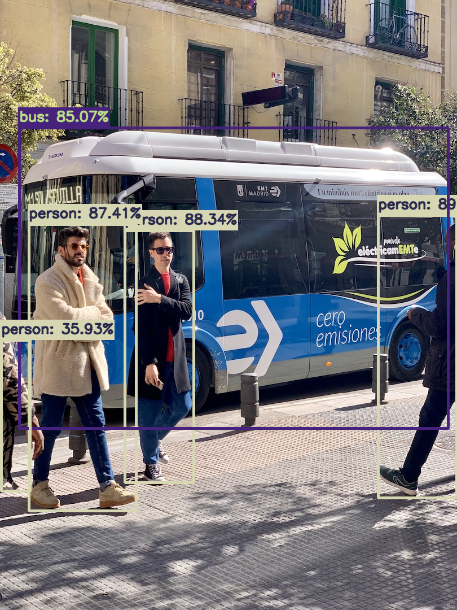
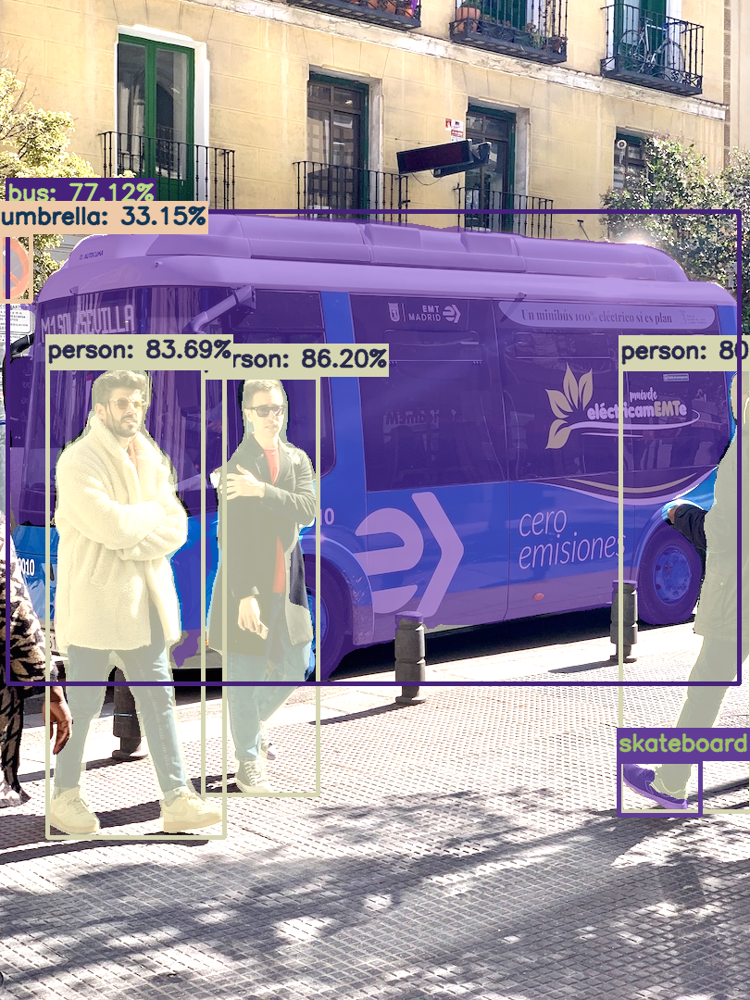
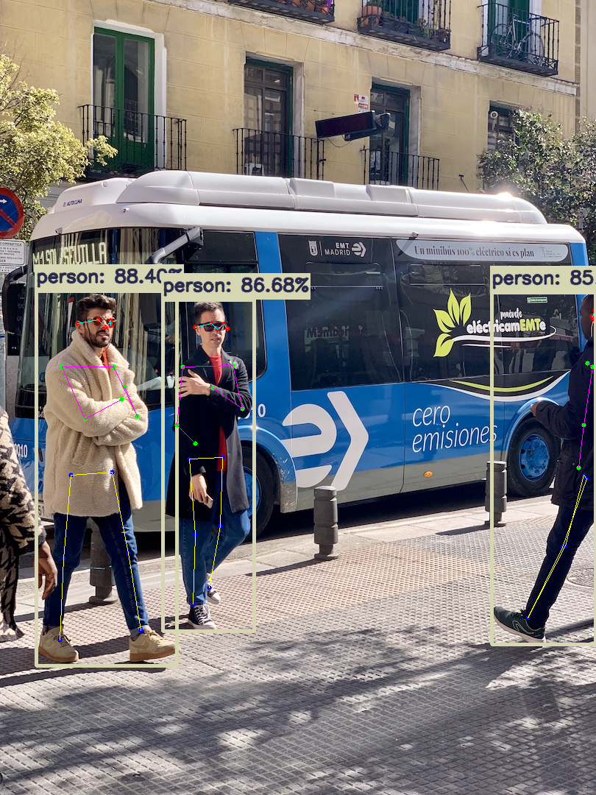

Deploy-YOLOv8-multitask
===
本仓库集成了YOLOv8的Detectation、Segmentation、Pose功能，代码通过C++和CUDA实现，通过TensorRT实现模型推理加速。

<table>
    <tr>
        <td></td>
        <td></td>
        <td></td>
    </tr>
</table>
